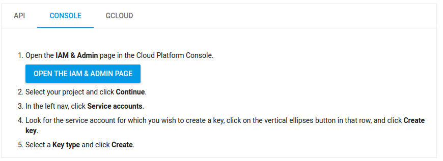
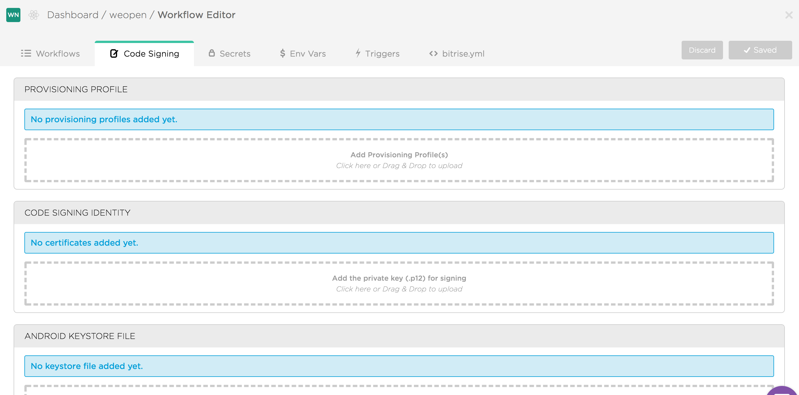

# Continuous Integration using Bitrise

Register Bitrise account and login, then add new app and configure it:
 1. Select repo you want to sync with bitrise  
 2. Add Bitrise ssh-key to your github account  
 3. Choose branch for scanning  
 4. Pass through repo validation (may skip warnings)  
 5. Select project build configuration and platform  

## Android
 1. Set up your Bitrise deployment workflow

  1.1. You can find android workflow examples in ``resources`` dir.  
  1.2. You can use Bitrise app signing and deployment for staging (and for Bitrise service testing) because it don't need additional Google Services integration  
  1.3. [Configure auto apk signing](http://devcenter.bitrise.io/android/code-signing/) - upload ``upload-keystore`` to Bitrise and use it as Env-variable.  

 2. Connect Bitrise building process with Google Play Console for production

  2.1 Hardest part is setting up `google-play-deploy` step. Here you should [get](https://cloud.google.com/iam/docs/creating-managing-service-account-keys) `service account key` from Google Cloud Platform (use console step way)
  
  2.2 Enable APIs and Services on [this page](https://console.developers.google.com/apis/dashboard) for created project  
  2.3 Get your own `Google Service Account Json Key` and upload it to [Bitrise generic storage](http://devcenter.bitrise.io/tutorials/how-to-use-the-generic-file-storage/) for better privacy and use it in yml as `Bitrise Environment variable`

## iOS
 1. Export your local provisioning profile and identities using [codesigndoc tool](https://github.com/bitrise-tools/codesigndoc)
 2. Upload exported provisioning profiles and identities to Bitrise.
 
 3. Set up build workflow. An example for iOS is in resources directory. It requires the following env variables/secrets:
  - `INFO_PLIST_FILE` - path to your `Info.plist`
  - `APPLE_TEAM_ID` - ID of your team on [Apple Developer Portal](https://developer.apple.com/account/ios/certificate/)
  - `ITUNES_APP_ID` - ID of your app from **iTunes Connect**
  - `ITUNES_USER` - email to login to iTunes Connect
  - `ITUNES_PASSWORD` - password to login to iTunes Connect
