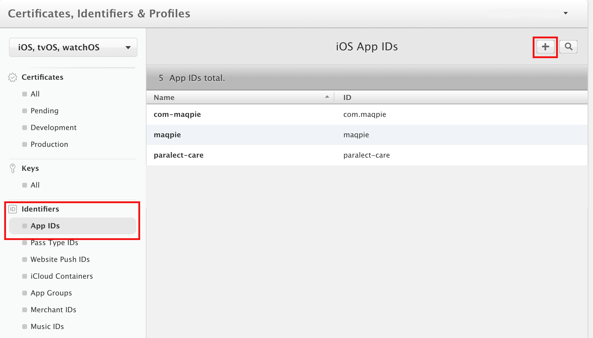
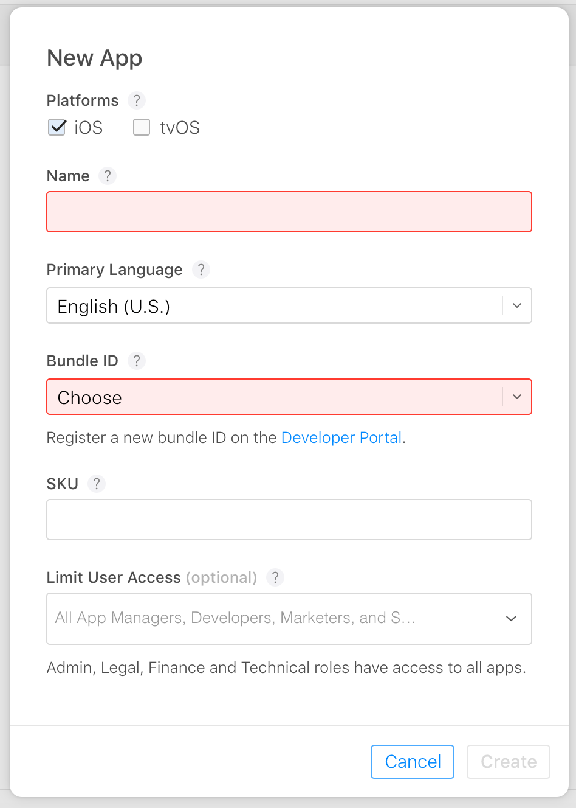
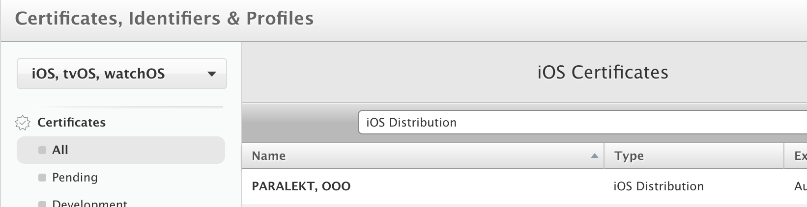
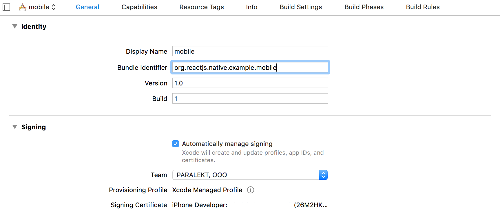

# Google Play app publishing

First of all you need to have Google Play Console access and publish your app first time using this service(later you will be able to do it using CI, eg Bitrise).

###### NOTE:
 You should have unique application ``package name``. It can cause changing ``google-service.json`` file (firebase integration) and some other cases. You can read about how to do it [here](https://stackoverflow.com/questions/37389905/change-package-name-for-android-in-react-native).

### Workflow:
1. Create application
2. Fill necessary app info. It marked by alarm icon  

3. And then you should upload your apk. [This is the best helper for you](https://support.google.com/googleplay/android-developer/answer/7384423?hl=en)
and [this one](https://developer.android.com/studio/publish/app-signing.html) for creating signing files (recommend you to use terminal way not a android studio because you should add secure information into tracked files to do this), you should do 2 of this files and certificates with them as base.
###### NOTE:
once created keystore you can use it to sign both staging and production builds.

4. After you build and sign your first apk choose release type (propose alpha)

5. Follow prepare to release steps and upload apk

6. Complete [signing steps](https://play.google.com/apps/publish/?hl=en&dev_acc=17770726722991848309#KeyManagementPlace:p=com.test.android.app) and get upload key certificate and second keystore
7. If you complete all steps following button will be active 

8. That is your trip to publishing app

# App Store/Testflight publishing

**Prerequisites: Apple account participating in Apple Developer Program and iTunes Connect account.**
 1. At first you have to create an AppId on [Apple Developer Portal](https://developer.apple.com/account/ios/certificate/)
 
 2. Then create an app on [iTunes Connect](https://itunesconnect.apple.com/). Select *Bundle ID* that you've created on previous step (it should be the same as you used in XCode project).
 
 3. Create (or import if it's already created for your team) iOS Distribution certificate (click on `plus` and then select `App Store and Ad Hoc`)
 
 4. Select your team in XCode (if it's not available try Download All Profiles in Xcode/Preferences/Accounts)
 
 5. In Xcode select `Generic iOS Device` and press Product/Archive.
 6. Once your binary is ready you will see it in organizer. Press `Upload To App Store`.
 7. Check entitlements of your build and click Next.
 8. After uploading your build will be processed. You will receive an email when it's ready.
 9. You may see Missing Compliance warning on Testflight build page. The build is still not available for testing, just click an answer on pop-up dialog to share it with testers. It can be fixed if set `ITSAppUsesNonExemptEncryption` to `NO` in your `Info.plist` file.

**NOTES:**
 - **Without review you can add only iTunes Connect users as testers. To start external testing you have to submit build for Beta App Review (requires demo account if sign-in is required for app).**
 - **You can't upload build to iTunes without app icons. Make sure you've added [all needed icons](https://developer.apple.com/ios/human-interface-guidelines/icons-and-images/app-icon/). Also you can see a warning if marketing icon (1024pt) is missing - in this case build can be processed by Apple and you can start internal testing but you won't be able to submit it to review.**
