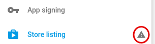
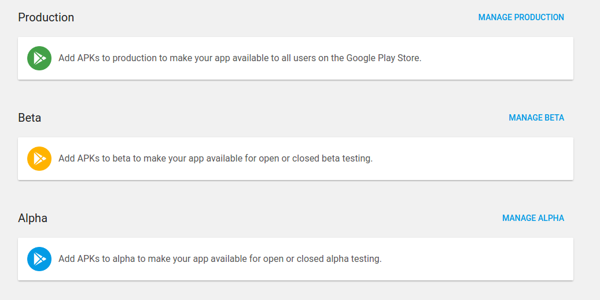
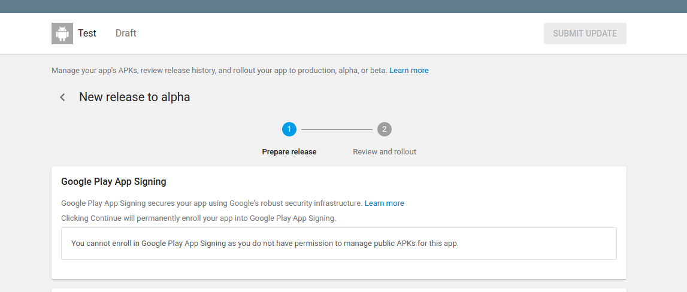
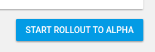

# Google Play app publishing

First of all you need to have Google Play Console access and publish your app first time using this service(later you will be able to do it using CI, eg Bitrise).

###### NOTE:
 You should have unique application ``package name``. It can cause changing ``google-service.json`` file (firebase integration) and some other cases. You can read about how to do it [here](https://stackoverflow.com/questions/37389905/change-package-name-for-android-in-react-native).

### Workflow:
1. Create application
2. Fill necessary app info. It marked by alarm icon  

3. And then you should upload your apk. [This is the best helper for you](https://support.google.com/googleplay/android-developer/answer/7384423?hl=en)
and [this one](https://developer.android.com/studio/publish/app-signing.html) for creating signing files (recommend you to use terminal way not a android studio because you should add secure information into tracked files to do this), you should do 2 of this files and certificates with them as base.
###### NOTE:
once created keystore you can you it to sign both staging and production builds.

4. After you build and sign you first apk choose release type (propose alpha)

5. Follow prepare to release steps and upload apk

6. Complete [signing steps](https://play.google.com/apps/publish/?hl=en&dev_acc=17770726722991848309#KeyManagementPlace:p=com.test.android.app) and get upload key sertificate and second keystore
7. If you complete all steps following button will be active 

8. That is you trip to publishing app
